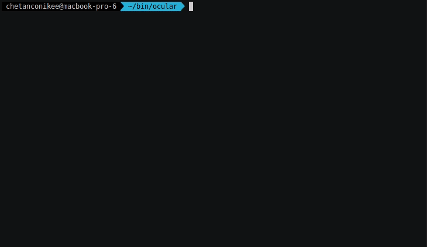

# Ocular Security scripts

This repository is a place to store and share customized security scripts and libraries to gain actionable insights into `Data Leaks, SCA, Business Logic Flaws, Rootkits, 0-day vulnerability hunting`, etc. If you find it useful and would like to share some cool scripts that you wrote for finding vulnerabilities in open source projects with us, or if you would like to help us to improve the project-specific libraries, please feel free to contribute and create a PR!

These scripts are categorized by language modules as each language has its own `syntax`, `semantics` and `APIs`. There are also some links to snapshots for specific versions of certain projects in the `README` files in this repository.

- [Java](java)
- [C](c) (Coming Soon)
- [CPP](cpp) (Coming Soon)
- [GO](go) (Coming Soon)
- [DOTNET](dotnet) (Coming Soon)
- [PYTHON](python) (Coming Soon)
- [SCALA](scala) (Coming Soon)
- [JS](js) (Coming Soon)

## Executing scripts

Import/Copy these scripts into your Ocular standard distribution. Remember to back up your existing scripts prior to copying over.
If you do not have a standard distribution, request for a full featured trial distribution of Ocular from [here](https://go.shiftleft.io/ocular-free-trial])

All scripts are written using [Ocular's query language](https://ocular.shiftleft.io) and can be executed in either interactive or autonomous mode. Refer to `README` in each of the language module folder for further details.

